## Introduction

Most of us blindly install the software we use without attempting to verify what exactly we're installing. This habit can be very expensive to the Bitcoin user. Here's a [story of users failing to verify installations of the Electrum wallet causing loss of 245 BTC](https://www.coindesk.com/electrum-wallet-attack-may-have-stolen-as-much-as-245-bitcoin).

In this lesson we'll really focus on installing software correctly. Honestly, this stuff kinda sucks. Nobody enjoys it. But we can't confidently use Bitcoin tools without learning to safely install them.

These instructions will focus on Windows because it's by far the most popular operating system. In future iterations of this class I'll try to provice instructions for Mac usera as well. 

If your confused, ask questions in Slack!

## Objectives:

- Install Electrum and Bitcoin Core wallets
- Start Bitcoin Core sync for testnet
- Create wallet with Electrum
- Receive testnet coins (tBTC) with Electrum

## Install Bitcoin Core

_If you already have Bitcoin Core installed, skip to "Sync Bitocin Core"_ FIXME

In this section I will guide you through the process of verifying and installing Bitcoin Core on Windows.

## MacOS / Linux Installation

Follow along with "Verify your download > MacOS/Linux verification instructions" sections of [the download page](https://bitcoincore.org/en/download/). I haven't had time to write out detailed explanations of each step like I will do with Windows. Ask in Slack if you have any questions.

## Windows Installation 

The next 9 sections of this tutorial will narrate the "Verify your download > Windows verification instructions" section of [the download page](https://bitcoincore.org/en/download/). Open that page and cross-references as we go through the steps.

## Step #1: Download Bitcoin Core Installer

Click this button at the top of the page to download a copy of the Bitcoin Core software. It is probably named `bitcoin-0.18.1-win64-setup.exe`.

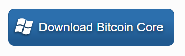

## Step #2: Download Signature File

- Right now we don't know if the `bitcoin-0.18.1-win64-setup.exe` file you just downloaded is the same piece of software released by Bitcoin Core developers. Someone could have hijacked the [bitcoincore.org](https://bitcoincore.org/en/download/) website and served you a malicious file. We want to _verify_ we downloaded the real Bitcoin Core software before installing it.
- Bitcoin Core lead maintainer [Wladimir van der Laan](https://github.com/laanwj/) publishes a unique fingerprint of each Bitcoin Core release. This fingerprint is a SHA256 hash of the file itself. We are able to create our own SHA256 hash of these files and compare with the fingerprint he publishes. If they match, we know we downloaded the real thing (assuming SHA256 isn't broken). If they don't, we know we didn't!
- Click the `SHA256SUMS.asc` link and it will download to your "Downloads" folder
  - This file contains "official hashes" for each platform (Mac, Linux, Windows, etc) for the Bitcoin Core 18.1 release.

## Step #3: Open Terminal, Navigate To Downloads Folder

- You are directed to open a "terminal" / "command line prompt" application. To do this on Windows, hit the "Windows button" (❖) on your keyboard, type "command prompt" and hit enter. A window should pop up that looks like this.

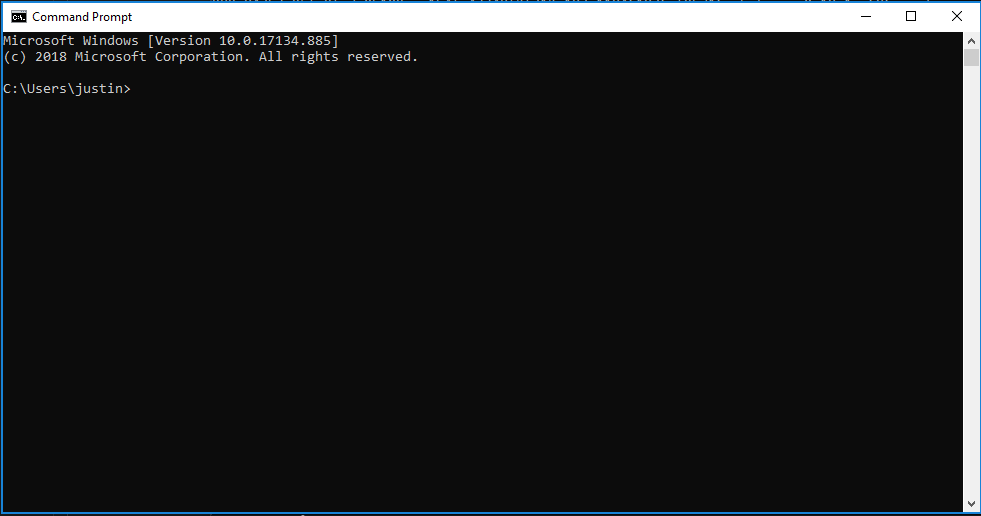

- Type out the `cd %UserProfile%\Downloads` command in that window and hit enter. 
  - `cd %UserProfile%\Downloads` just moves you from your home folder into your "Downloads" folder.
  - I ask you to type out the command because copying commands off the internet and pasting them into the terminal can be very dangerous. [This site](http://thejh.net/misc/website-terminal-copy-paste) demonstrates an attack where arbitrary text is injected into your clipboard. Try copying the text and paste it into a Word document. You wouldn't want to paste something like this directly into the terminal because it could execute arbitrary commands on your computer.

## Step #4: SHA256 Hash Bitcoin Core Installer

- Type `certUtil -hashfile bitcoin-0.18.1-win64-setup.exe SHA256` into the Command Prompt and hit enter.
- This command produces a SHA256 hash on the `bitcoin-0.18.1-win64-setup.exe` file we downloaded in step #1. In the next step we will compare this hash with the "official hash" according to Wladimir.

## Step #5: Compare Our Hash With Wladimir's Hash

- Type out the command `type SHA256SUMS.asc` into Command Prompt and hit enter
  - This command prints out the contents of `SHA256SUMS.asc`
- The top half of the file has 2 columns:
  - Right: filenames of Bitcoin Core software for various platforms. Assuming we're using 64-bit Windows, we care about `bitcoin-0.18.1-win64-setup.exe`. This hash is highlighted in red in the image below.
  - Left: hashes of those file according to Wladimir van der Laan
- The bottom half contains a GPG signature of the top half of the file. This signagure provides proof that Wladimir van der Laan really produced these hashes, and not [some imposter](https://thumbor.forbes.com/thumbor/960x0/https%3A%2F%2Fblogs-images.forbes.com%2Fthomasbrewster%2Ffiles%2F2016%2F05%2FScreen-Shot-2016-05-02-at-10.20.41-1200x676.jpg)!
- You want to check that the two hashes outlined with red boxes match. The top box is your hash, the bottom box is Wladimir's.

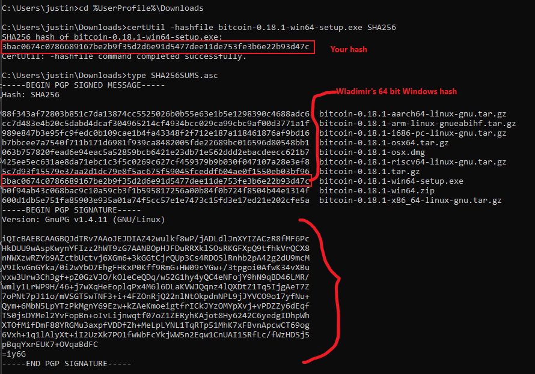

The remaining steps help you verify the GPG signature contained in the bottom half of `SHA256SUMS.asc`, to verify that Wladimir really produced the hashes we're comparing against.
  
## Step #6: Download GNU Privacy Guard (GPG)

- (Optional) Follow [this video](https://www.youtube.com/watch?v=QZ2GrQA_ye8) to validate the hash of GNU Privacy Guard.
- (Optional) If you want to be extremely paranoid, you can attempt to install OpenPGP and verify the "OpenPGP Signatures" listed [the same page](https://gpg4win.org/package-integrity.html)
- When you run `gpg4win-3.1.10`, a "Do you want this app to make changes to your device?" dialogue will appear. You can compare the information listed on [this page](https://gpg4win.org/package-integrity.html) with the information contained within the dialogue's "Show more details" > "Show information about publisher's certificate" > "Details" > "Serial number" to check that this software was signed with the correct key from Microsoft's point-of-view.

Windows' GPG support is poor compared to Linux, where GPG is usually installed by default. This is one of the advantages of using Linux when working with Bitcoin.

## Step #7: Import Wladimir's GPG public key

- Open a new command prompt window
  - Hit the "Windows button" (❖) on your keyboard
  - Type "command prompt"
  - Hit enter
- Type out `gpg --recv-keys 01EA5486DE18A882D4C2684590C8019E36C2E964` and hit enter
  - You can verify that this is actually Wladimir's key by looking at FIXME
- You should see a message like this telling you that the key was successfully imported:

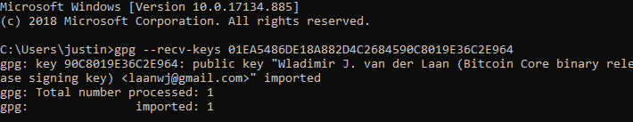

## Step #8: Verify SHA256SUMS.asc Signature

- Type `gpg --verify SHA256SUMS.asc` into the terminal and hit enter
- You should see output like this:

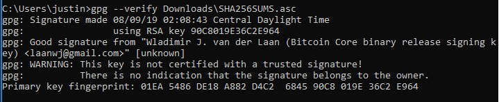

## Step #9: Interpret Step #8 Output & Install Bitcoin Core

- You want to make sure that the hexidecimal (0-9, A-F) characters in `Primary key fingerprint: 01EA 5486 DE18 A882 D4C2  6845 90C8 019E 36C2 E964` line match the hexidecimal characters form the `gpg --recv-keys 01EA5486DE18A882D4C2684590C8019E36C2E964` command we received earlier. This means the same key was used.
- To remove the "key is not certified with a trusted signature" error message you would need to get other trusted people to attest that Wladimir's public key fingerprint is actually `01EA5486DE18A882D4C2684590C8019E36C2E964`. [Here is some documentation about how this "web of trust" works[(https://www.gnupg.org/gph/en/manual/x547.html). We won't cover this advanced GPG usage in HODL Bootcamp.

If you made it all the way here, I salute you. You are reasonably certain that you downloaded the right software, and I mentioned 2 places where you could do more verification (verify GPG install using OpenPGP and hash comparisons, and make use of GPG's "web of trust" model to verify Wladimir van der Laan's public key). 

To actually install Bitcoin Core, open your Downloads folder and double click on `bitcoin-0.18.1-win64-setup.exe` and accept default options within the setup wizard:

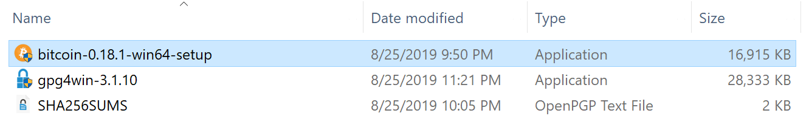

In the final step you can uncheck the "Run Bitcoin Core (64-bit)" option since this will run it in "mainnet" mode we want to run it in "testnet" mode:

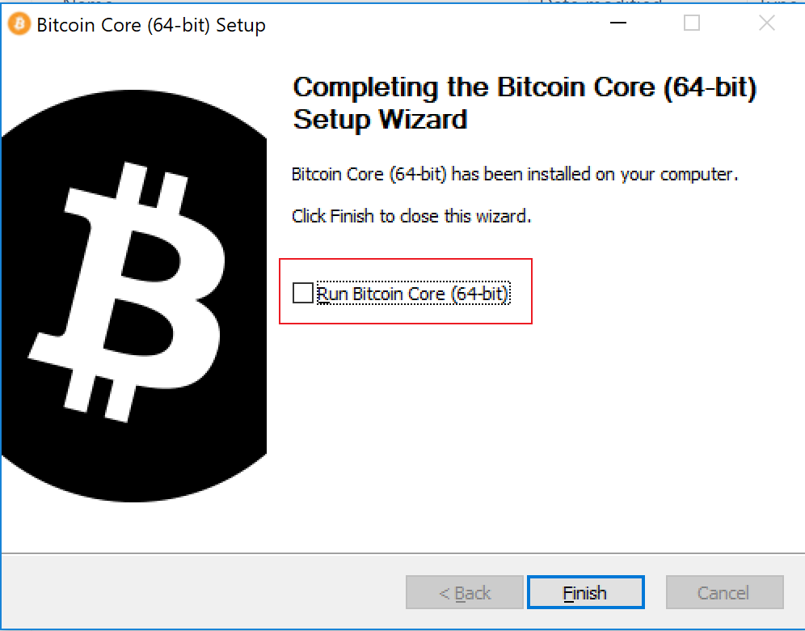

## Sync Bitcoin Core

Bitcoin Core is a "full node" which means that it must download the entire history of the network in order to display balances. The benefit of this is that you don't need to trust or leak privacy to a third party. The cost is that it takes time and computer resources to download and store all this data.

We need to download the entire history of the "testnet" chain so that we can use Bitcoin Core testnet wallet later in the course. This will take around 20 gigabytes of disk space on your computer. I'll show you how to remove it at the end of the course.

- Hit the "Windows button" (❖)
- Type "bitcoin core testnet"
- Click on the top option

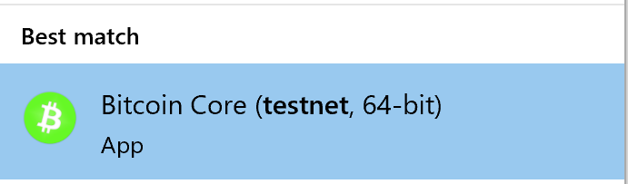

- Leave this program open until the progress bar at the bottom reaches 100%
- We will use Bitcoin Core later once it finishes syncing

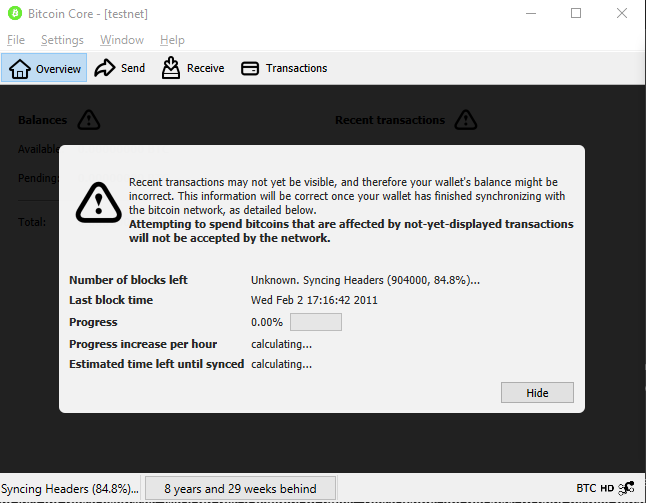

## Download Electrum

Electrum is a “light wallet”, meaning that it doesn’t have to download the complete history of the network in order to display balances and instead just requests these balances from others. The benefit is that it works instantly and doesn't require very much storage space. The cost is leaked privacy and some degree of trust in third parties.

- Type `electrum.org` into your browser and hit enter
  - Electrum has been subject to phishing attacks with fake copies of the website. It's a good idea to just type the official url yourself, rather than clicking on links.
- Click the `Download` tab at the top of the page
- Click the following two links to download the Windows installer and a signature of the Windows installer

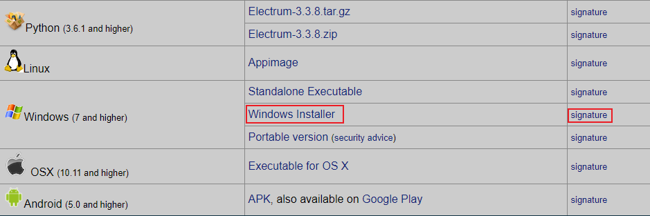

- If the "signature" link takes you to a page like the one below, just type `Control-s`, choose file name "ThomasV.asc" and click "Save" to save it as a file.
  - You might have to do this in the next step as well. Choose "electrum-3.3.8-setup.exe.asc" as the file name if so.

- Click this link to download the GPG public key of Electrum's lead developer, Thomas Voegtlin (ThomasV). You can double-check that file against [this copy hosted within the Electrum repository on GitHub](https://github.com/spesmilo/electrum/blob/master/pubkeys/ThomasV.asc) if you want to double check this really is his public key.

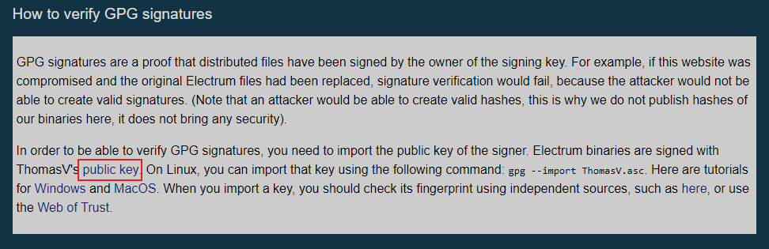

- Now we have downloaded the Electrum Windows installer, a signature of the installer, and a public key of the author. You should be able to see all three in your downloads folder:

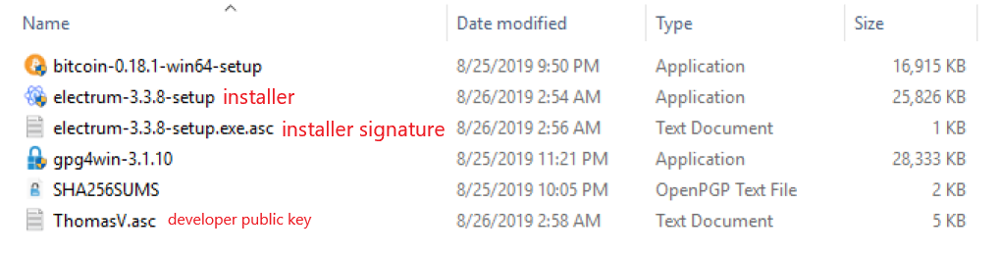

If you look 2 screenshots up (where we downloaded Thomas' public key) you see that we can import it into GPG with `gpg --import ThomasV.asc`. Let's do this:

- Open command prompt (Hit the "Windows button" (❖) on your keyboard, type "command prompt" and hit enter)
- Run `cd %UserProfile%\Downloads` to move to your Downloads directory
- (Optionally run `dir` to see everything in your Downloads folder)
- Now that we're in the same folder as `ThomasV.asc`, type `gpg --import ThomasV.asc` and enter to import it into GPG.
- The output should look like this

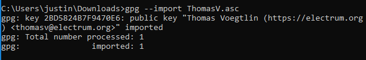

Now it's time to verify the `electrum-3.3.8-setup.exe.asc` signature file was really signed with the private key corresponding to the `ThomasV.asc` public key we just imported. Execute the command `gpg --verify electrum-3.3.8-setup.exe.asc electrum-3.3.8-setup.exe` to do this. This checks whether a hash of the `electrum-3.3.8-setup.exe` file has been signed by the private key corresponding to public key `ThomasV.asc`.

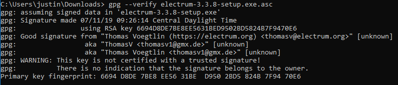

- "Good signature" tells us that the `electrum-3.3.8-setup.exe` file was signed with the `ThomasV.asc` key
- Note that we still get the warning that we haven't used the "web of trust" to validate ThomasV's public key. Once again, we won't cover this advanced topic in the alpha version of HODL Bootcamp.

Now that we've verified the installer, let's run it. Double click on `electrum-3.3.8-setup.exe` in your Downloads folder. Accept all the default options during the installation.

## Run Electrum

To run Electrum in "testnet" mode:

- Hit the "Windows button" (❖)
- Type "electrum testnet"
- Click on the top option

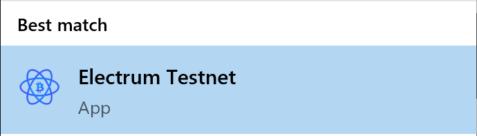

You'll be greeted with the following dialogue. For now we'll choose the "Auto connect" option. Later on we'll briefly cover choosing particular electrum servers to connect to, and the option of running your own Electrum Personal Server. 

Next it asks you to create a wallet. Let's name our first wallet "hodl_bootcamp_first_wallet".

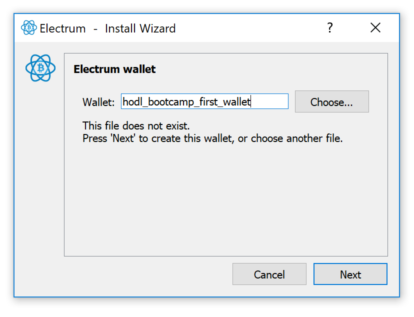

- Select "Standard wallet". We'll try a "Multi-signature wallet" later on.

- Most bitcoins are spendable if you know a large random number called a "private key"
- Large numbers are hard to deal with, so most wallets convert this large number into a list of words called a "seed" or "mnemonic" because a list of words is easier for humans to deal with.
- Select "Create a new seed" to have Electrum create such a seed for us. 

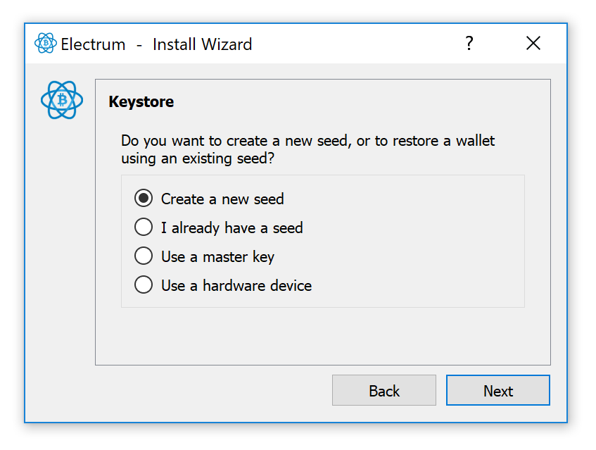

Electrum has 2 kinds of "standard wallet". "segwit" wallets which use the new Segregated Witness transaction format, and "legacy" wallets which do not.

Segwit transactions offer many benefits:
- Cheaper
- Easier for wallets verify change amounts
- Nodes verify signatures more efficiently

But some drawbacks:
- Use bech32 addresses, which some crappy wallets aren't yet able to spend to

Let's select "Segwit" for our first wallet:

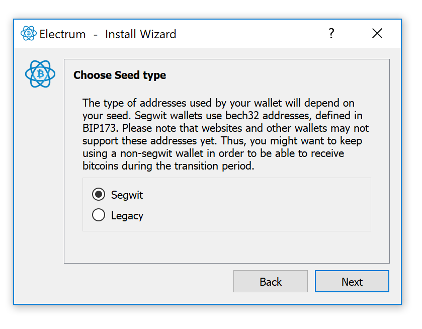

The next screen displays your wallet seed, a human-readable representation of the large number that can be used to spend all testnet bitcoins (tBTC) sent to this wallet.

Write these down in your paper notebook. To develop good HODL habits, never copy and paste these words even when we're using worthless testnet coins. Click "next" once you've written them down.

FIXME: image of how you would write them out on paper

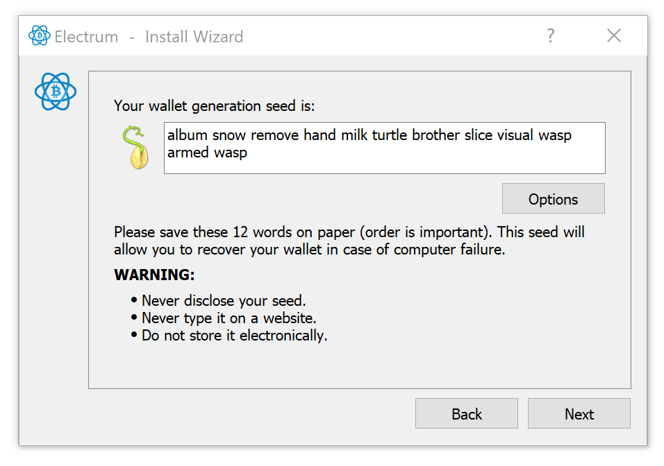

Next you'll be prompted to type out the words to ensure you've recorded them:

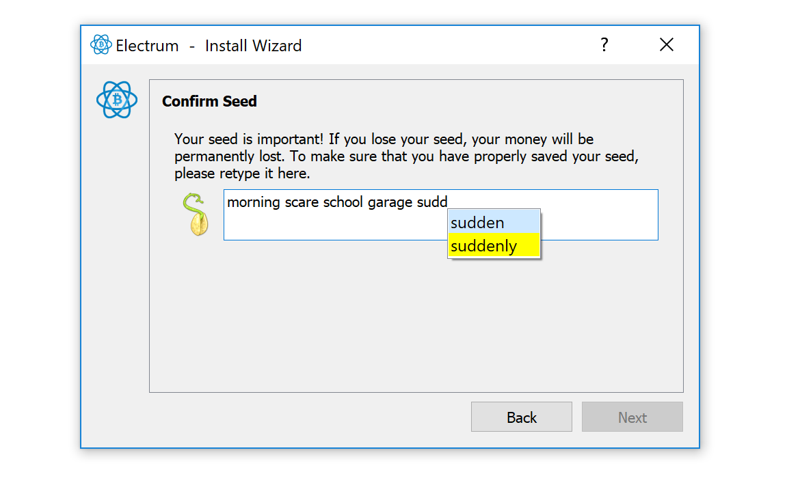

Lastly you'll be invited to choose a password to encrypt your wallet information. We won't enter a password this first time so that you can see what kind of information is contained in an unencrypted wallet file.

Click "Next" without entering a password.

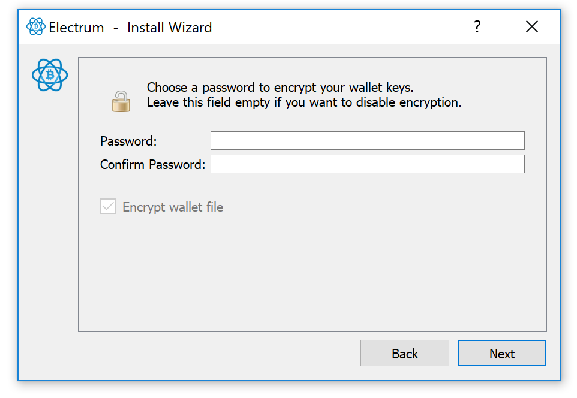

You may be greeted by a message like the following. Let's say "No". In general, it's better to manually check whether your electrum version is up-to-date rather than follow update instructions presented by the UI. There have been some successful auto-update scams recently and this practice would help you steer clear.

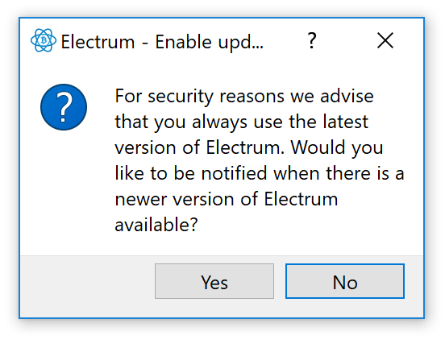

## Receive Your First tBTC

Since testnet coins have no value, people create "faucets" which give them away for free.

To send yourself some testnet coins, click on the "Receive" tab in Electrum and copy the address.

Paste it into the address field in [this faucet](https://coinfaucet.eu/en/btc-testnet/) and click "get bitcoins"

Congrats! You now own testnet bitcoins on a verified installation of Electrum. Tomorrow we'll learn to use Electrum in more detail.