# Part 2

## Objectives:

- Send bitcoins with Electrum
- Label outputs and addresses
- Fees and RBF
- Encrypt wallet file
- Rehearse wallet recovery

## Send tBTC

Open electrum in testnet mode (see [part 1](./part-1.md#run-electrum) if you forgot how).

Let's take a peek at how our addresses look. Checking this view before and after sending will help us understand . Click "View > Show addresses" to make the addresses tab visible and click it. 

Let's also change our base unit to the satoshis with "Tools > Preferences > General > Base unit > sat".

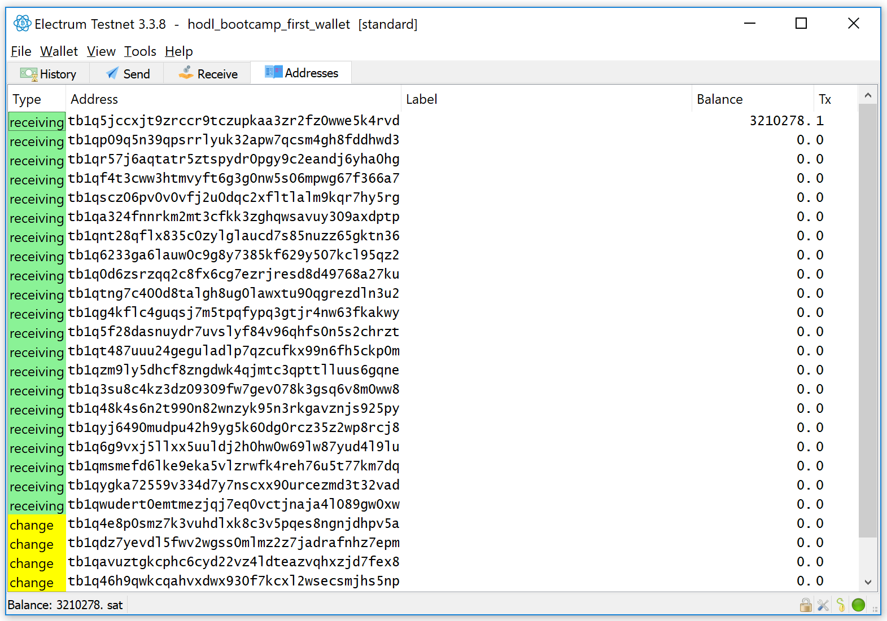

- Notice there are two "types" of addresses: receiving and change
  - Receiving addresses are what you give to other people when requesting payment from them
  - Change addresses are for the leftover amount of your inputs after funding outputs in each transaction
- There's a column for address labels, which we haven't used yet
- Only one address has a balance
- That address only has 1 transaction associated with it
  
Now that we understand the state of our wallet, let's send 1 satoshi back to the testnet faucet and observe how it changes. Their address is `mv4rnyY3Su5gjcDNzbMLKBQkBicCtHUtFB`. You can verify this by clicking the "donate?" button on the [coinfaucet.eu page](https://coinfaucet.eu/en/btc-testnet/) page.

- Paste this address in the "Pay to" field
- Enter in a description
- Add a 1 sat amount
- Hit "send"

You'll be asked to confirm the fee. 144 satoshis quite a large fee relative to the 1 satoshi we're sending, but we'll accept! Next you should see a "payment sent" dialogue containing the transaction id.

Let's see how our addresses look:

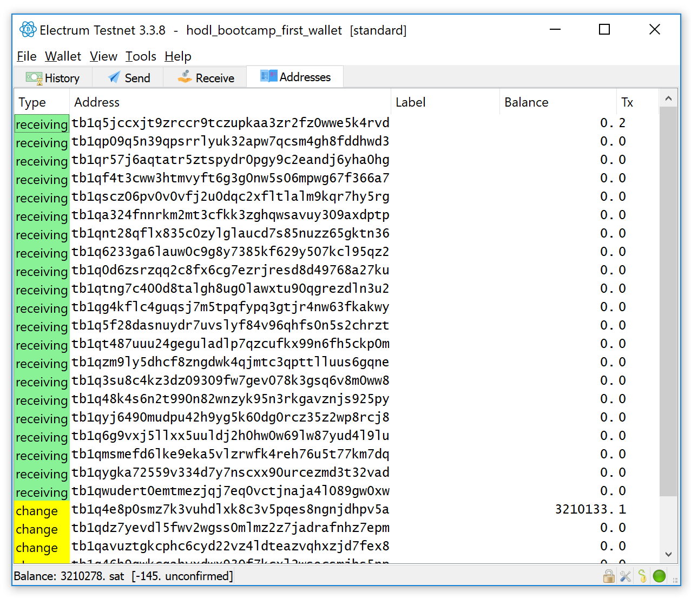

- Our first receiving address now has 2 transactions associated with it: one receiving coins and another sending coins away
- Now our entire balance is held by the first change address. This is what was left over after sending 1 satoshi to the faucet and 144 satoshis to the miner -- change.

Not that you can hover or double-click on any transaction in the "history" view to track how many confirmations it has:

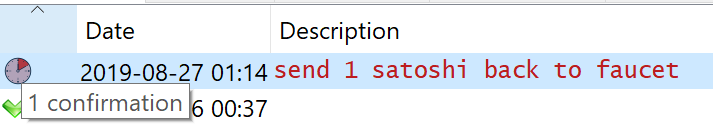

## Fees

Return to the send tab. Try sliding the "fee" slider. Notice that it doesn't change much. Mine fluctuates between 1 and 1.5 sat / vByte. This is because there is little fee-pressure on testnet. It's not used nearly as much as mainnet.

On mainnet it fluctuates more, but kind of blunt. Sometimes you want more precision than it offers (I often send 1 sat / vByte transactions which usually aren't available in the slider ...). Click "Tools > Preferences > Fees > Edit Fees Manually". From now on you can enter in the fee rate you want to pay on your transactions.

Here are two tools that help you understand mempool congestion on mainnet
  - https://jochen-hoenicke.de/queue/#0,24h
  - https://bitcoinfees.earn.com

## RBF

Imagine our fee is too low, and our transaction is taking too long to confirm. Electrum can do "Replace-by-Fee" which will create a new transaction spending the same outputs as the stuck transaction -- but with a higher fee -- and hopefully some miners will be enticed to mine this one instead.

First, send 1 satoshi back to the testnet faucet using 1 sat / vByte fee

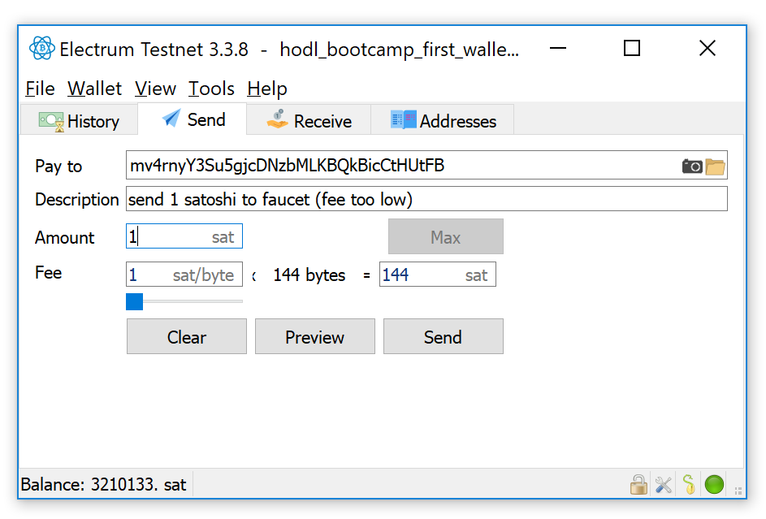

Next, right-click on that output and select "bump fee"

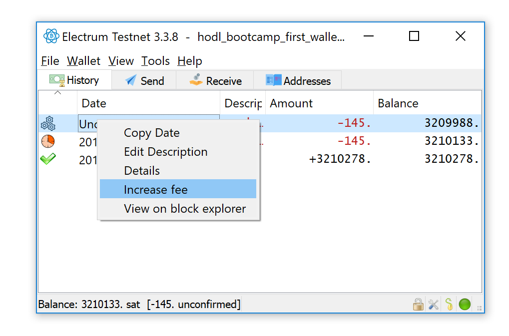

Lastly, enter in a 2 sat / vByte fee rate, click OK, sign and broadcast

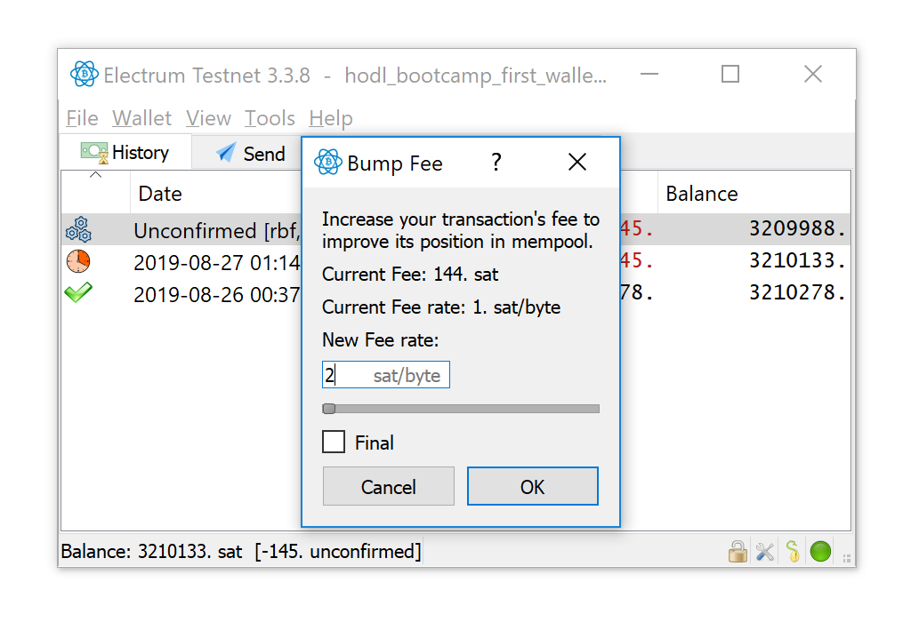

# Labeling Outputs

Let's pretend we have 2 classes of coins: "clean" coins and "dirty" coins. Maybe we got the "dirty" coins in some nefarious manner. We'll try to never mix the two classes of coins.

First, go through each of the addresses and label it "clean"

Label a new, unused receiving address "dirty"

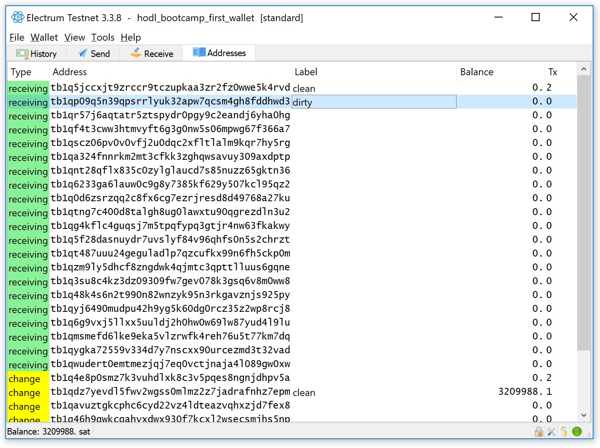

Send yourself some more coins to the "dirty" address by right-clicking on it and selecting "copy address" (link to [one](https://testnet-faucet.mempool.co), [two](https://bitcoinfaucet.uo1.net) faucets)

## Coin Control

Say we want to send another "clean" satoshi to the testnet faucet. How can we do this and not accidentally send a "dirty" coin? 

We can list our spendable coins with "view > show coins"

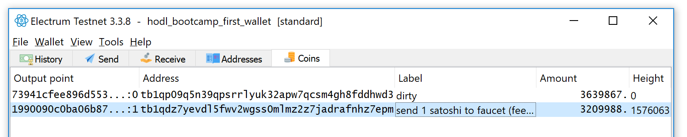

Now right click on the one that isn't labeled "dirty" coins and click "spend"

You can fill out the spend form just like normal, and the "preview" windows should confirm that we're sending the same "clean" output (txid, output index) that we right-clicked on. 

After sending we see that our "clean" labeled change output was spent and the "dirty" labeled receiving output was untouched.

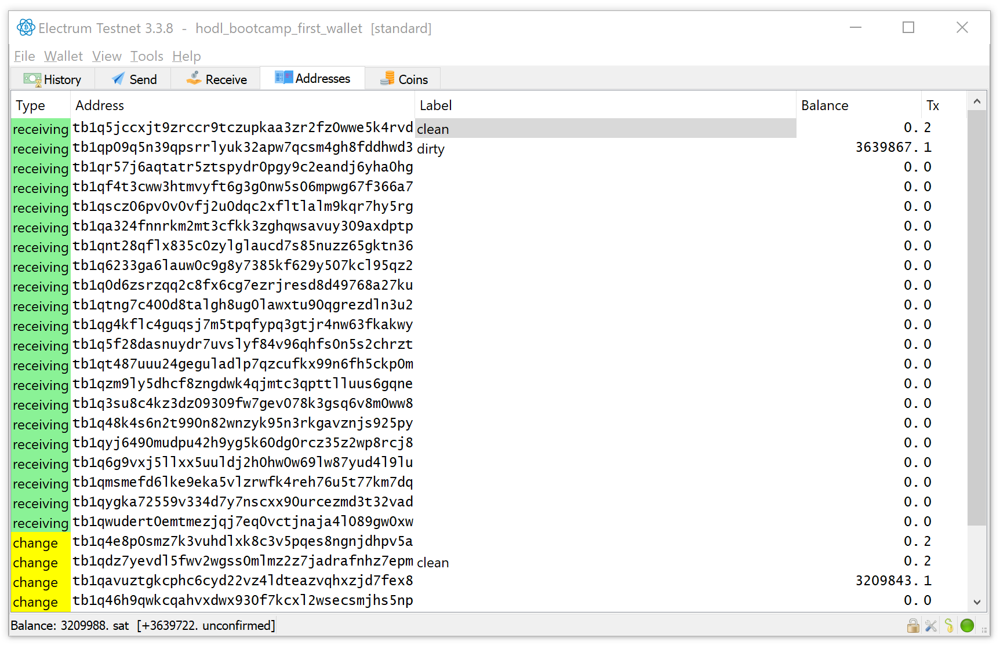

## Wallet File Encryption

You wallet file should be found in:
- Windows: %APPDATA%\Electrum\testnet\wallets\hodl_bootcamp_first_wallet
    - double-click and open with notepad
- Mac: FIXME
- Linux: FIXME

This is the contents of your wallet file. It contains some extremely sensitive data. This part is the worst:

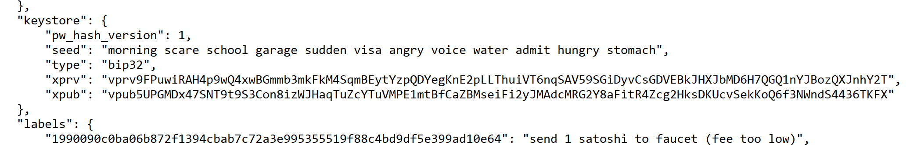

A "seed" is the human-readable representation of your private key. An "xprv" is the machine-readable format of your private key. If anyone gets their hands on either one of these, they can steal all your bitcoins. With your wallet file unencrypted, this isn't so hard. Someone just needs to get into your computer somehow and locate this file.

But if we encrypted this file, they would also need to either figure out our password (steal it, keylogger, etc) or break the encryption (unlikely). This is much safer than storing private keys in plaintext (unencrypted). Never store private key information in plaintext on an internet-connected computer. It's easy pickings for thiefs.

So what to do about it? Click the lock button at the bottom right of the screen. This will encrypt our wallet file for us.

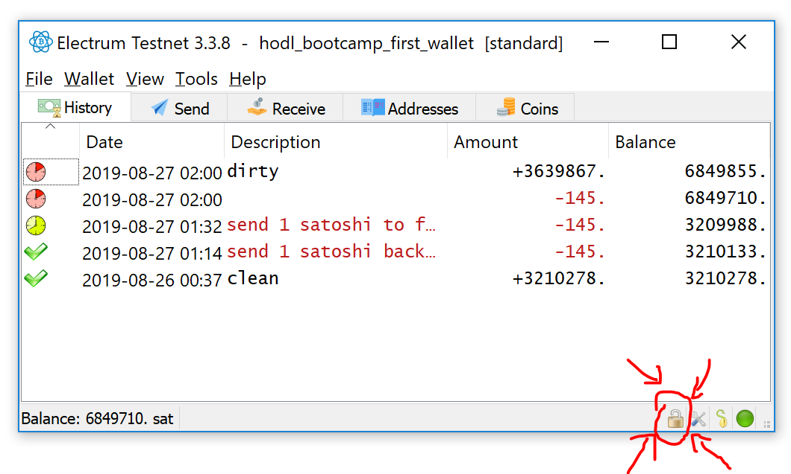

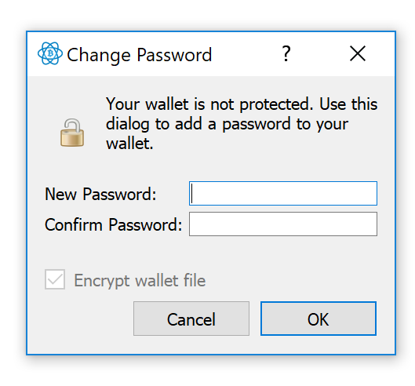

Choose a password and write it down on the same piece of paper containing your seeds.

Close and re-open the wallet. You'll be prompted to enter a password to unlock your wallet

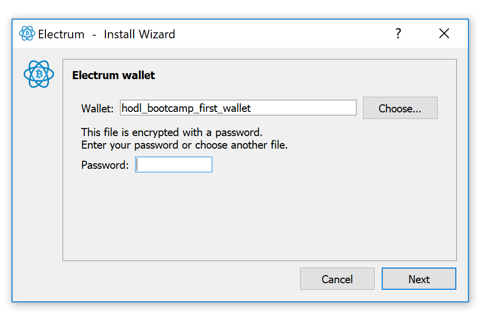

You can open up the wallet file again and it will look something like this:

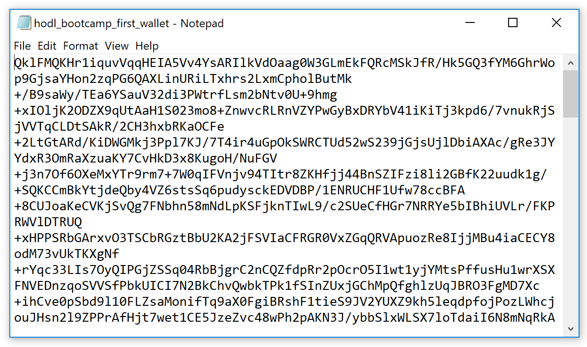

Note: This password encrypts your wallet file. You don't need it to recover coins from you mnemonic.

## Wallet Recovery

Let's simulate disaster. Our computer is stolen. If our wallet password is good, it's unlikely that the thief will be able to steal our funds. But how can we recover them and spend as we did before losing our computer?

- Click "file > New/Restore"
- Choose a new name: "hodl_bootcamp_first_wallet_recovery"
- Choose "segwit wallet"
- Choose "I already have a seed"
  - Type out the seed words from your notebook
  - Try entering 1 word in wrong. Notice that the "next" button isn’t clickable. This "checksum" is a guard against typos.
  - Don't choose a password (to demonstrate that the wallet password isn't involved in recovery)
- You should see a new "wallet" window pop up containing all the addresses from before. But notice that all the labels are gone! We won’t use this wallet any further because it doesn’t have the labels, but it’s important to rehearse how to do this. Your seed words aren’t any good if you don’t know how to use them!

Optional: try this again but select "legacy" instead of "segwit". Your balances won't show up. This because electrum doesn't know how the private key was used. looks on the blockchain for "legacy" addresses produced with this key, and doesn't find any.

And it isn't just the address type. Most wallets nowadays are "hierarchical deterministic" wallets. This means there's one master key which is used to generate a tree of child keys.

FIXME: IMAGE

The child key that produces your addresses can live somewhere deep in the tree. In electrum legacy its FIXME. In electrum segwit its FIXME. You have to tell electrum where to find these keys or it won't always be able to find them itself.

To review, wallet recovery requires:
- knowing what type of transaction outputs were created
- knowing which derivation path was used if you using HD wallets