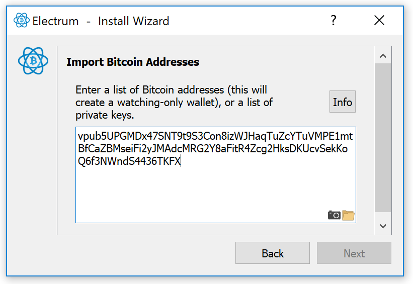
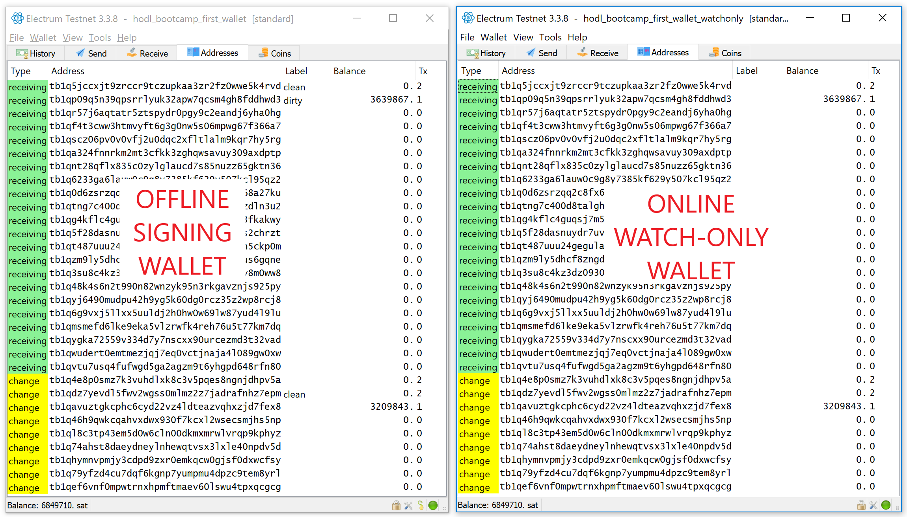
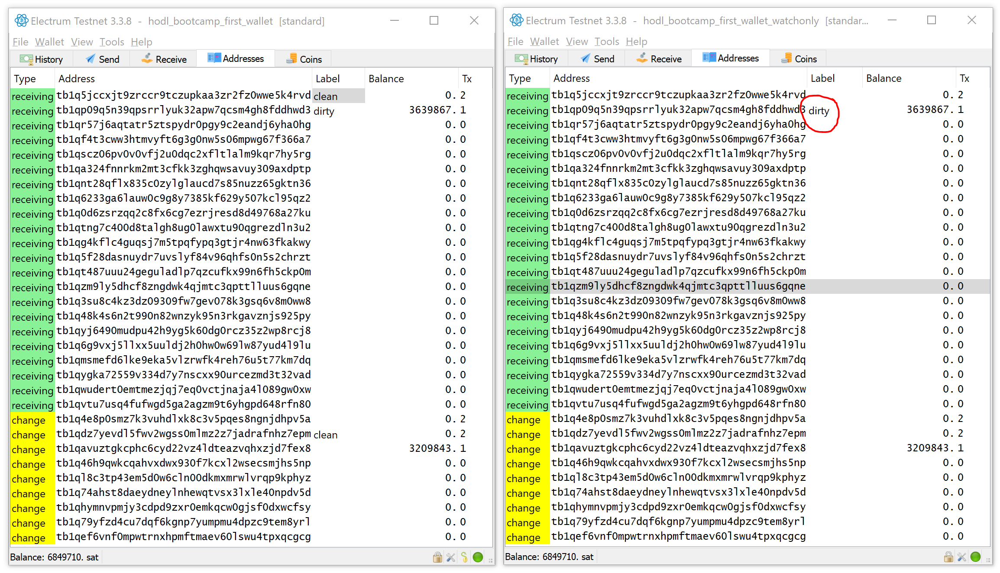
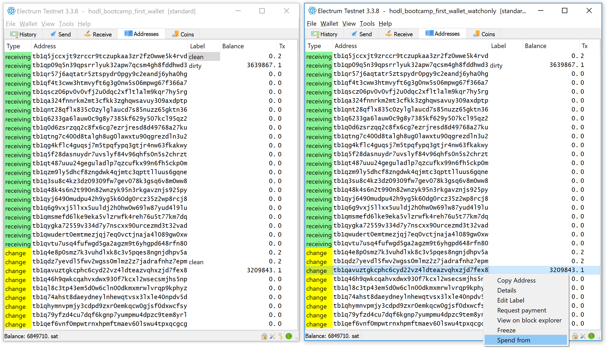
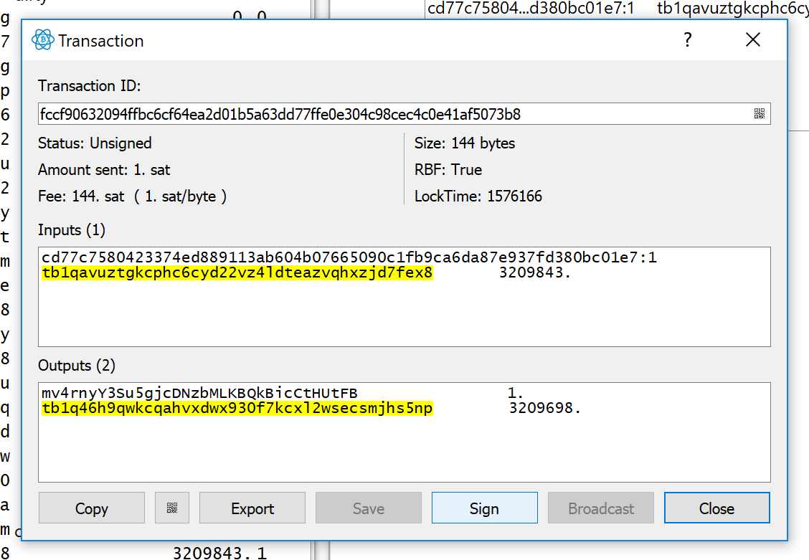

# Part 3

Modern computers are immensely complex. Operating systems contain millions of lines of code. [Small typos can break the whole machine](https://blog.codecentric.de/en/2014/02/curly-braces/). Computer hardware supply chains compose hundreds of companies all over the world. Every major government's intelligence agencies work to compromise these machines and supply chains to aid in intelligence gathering. 

As a result, it shouldn't surprise you if your desktop computer can be hacked. With a motivated adversary, you should probably expect it. So, where to store your bitcoins?

Our wallet encryption was a good first step -- but signing transactions would still required decryting the wallet file and that's our single point of failure. Malware could watch for that moment, and send every coin we have to the attacker.

The most obvious way to prevent this sort of attack would be to never connect the computer containing our private key to the internet. But in this case, we need some way for an internet-connected machine to compose transactions for the offline wallet to sign, since the offline wallet won't be able to connect to observe blockchain and figure out what coins are ours to spend.

## Watch-Only Wallet

Let’s create a watch-only wallet associated with the wallet above. First, go to the “hodl_bootcamp_single_recovery” wallet, click “wallet > information” and  click the copy button at the bottom of the text field. That will copy your *public key* to the clipboard.

- Click "File > New / Restore"
- Select "Standard wallet"
- Select "Use a master key"
- Paste in your *public key* and click “next”

- Click "Next" again to skip the passphrase
- Stick `hodl_bootcamp_first_wallet` to the left. We'll pretend this is an offline, signing wallet.
- Stick the new `hodl_bootcamp_first_wallet_watchonly` to the right side of the screen. This is our online, watch-only wallet that prepares and broadcasts transactions.
- Open up the addresses tab on each wallet and note that it tracks exactly the same addresses

- Navigate to the "send" tab on watch-only on the right side. Notice that the “send” screen has no “send” button -- only a “preview” button. That’s because watch-only wallets can prepare unsigned transactions but cannot sign them. It has no private key, just a public key. It can see out coins, but can't spend them.

## Offline signing

Before we get started, let's label our "dirty" output in the "addresses" view of our watch-only wallet to your right. We'll stop labeling our "clean" outputs and just keep track of our "dirty" output. Easier that way.

First let's prepare a transaction on our watch-only wallet to the right. Let's choose the non-dirty output:

Prepare the transaction with the online watch-only wallet to the right:
- Pay to `mv4rnyY3Su5gjcDNzbMLKBQkBicCtHUtFB`
- Add a description if you like
- Set amount to 1 satoshi
- Set fee to 1 sat / byte
- Hit "Preview" button
- Select "copy" to copy the transaction to your clipboard
- Optional: Decode the unsigned transaction
  - click "view > show console"
  - click the "console" tab that just appeared
  - enter `deserialize("")` and paste the contents of your clipboard between those quotation market. 
  - This "console" runs Python code. `deserialize` is a function that turns a raw unsigned transaction into a "dictionary" that more clearly describes what this transaction does

Sign the transaction with the offline signing wallet to the left

- Optional: Disconnect from wifi to simulate doing this on a truly cold machine ...
- Click "Tools > Load transaction > From text" and paste in the unsigned transaction

- Inspect it

- Click "Sign" to sign it
- Enter password
- Click the copy button again to get the raw *signed* transaction off your "cold wallet"
- (turn your internet back on if you turned it off)

Broadcast with watch-only wallet

- click "tools > load transaction > from text"

- Inspect it
- Click the "broadcast" button to send out to the network

There you go! Hopefully you have a pretty good idea how Electrum's workflow would work with hot and cold machines

Exercise: Try this on multiple computers
- The "preview" screen has a QR code button that will produce a QR code reqresenting the unsigned transaction, and "Tools > Load transaction > From QR code" can read a QR code. Use these two features to pass an unsigned transaction from an online to an offline computer and then pass the signed transaction back to the online computer from the offline computer.

## Hardware Wallets

This offline-signing setup seems like a big improvement -- but how can we be absolutely sure that the thing cannot connect to the internet? We'd really need to scrutinize every chip on the device which takes a lot of time and expertise.

Another problem with a laptop is that it just has such a huge surface area for attacks. Nobody can audit all those millions of lines of code. And if the device really just needs to be able to validate and sign bitcoin transactions -- most of the stuff included in a modern operating system is completely unnecessary.

For these and other reasons, "hardware wallets" were created. They're simple devices that cost around $100. Their only job is storing bitcoin keys and signing bitcoin transactions using those keys without leaking the private keys in any way. They don't contain any networking chips, shouldn't contain any non-bitcoin code, and are only accessible by USB wire or QR code. Hundreds of bitcoin developers use and scrutinize the code and hardware these devices use, trying to spot vulnerabilities before attackers do.

Hardware wallets are probably the best way for the average person to HODL bitcoins.

## Single-Signature Hardware Wallet

If you have a hardware wallet, try following along with [this guide](https://github.com/DriftwoodPalace/guides/blob/master/hodl-guide-light/README.md#create-the-wallet) to use your hardware wallet with electrum. This setup is a lot like the offline signing + watch-only setup we had earlier: we just replace the offline laptop running electrum we have a hardware wallet.

## Multi-Signature Hardware Wallet

Hardware wallets are a big step forward security-wise. But they can still fail. Perhaps someone physically takes your hardware wallet, [there are many ways they can extract the private key](https://ledger-donjon.github.io/Unfixable-Key-Extraction-Attack-on-Trezor/). If you want to learn more about flaws in hardware wallets, check out [this 30 minute talk for a comprehensive history of hardware wallet attacks](https://www.youtube.com/watch?v=P5PI5MZ_2yo)

Hardware wallet failure is unlikely but still possible. Ideally your cold storage setup could withstand at least 1 catastrophic hardware wallet failure without comprimising your funds. Multi-signature can help you do this.

Multi-signature is a bitcoin transaction scheme allowing N keys to collectively control a bitcoin output, but only requiring M signatures from those N keys to move an output. If M is 2 and N is 3, you are able to lose 1 key without losing your funds. If M is 3 and N is 5, you can lose 2 keys and still move your coins to safety.

If you generate, store and interact with each key differently, it becomes likely that any one attack takes out no more than one of your keys.

If you would like to try hardware wallet multisig, check out [this guide](https://github.com/DriftwoodPalace/guides/blob/master/hodl-guide/README.md). This is a long guide, but I'm happy to answer any questions you have about it in Slack.